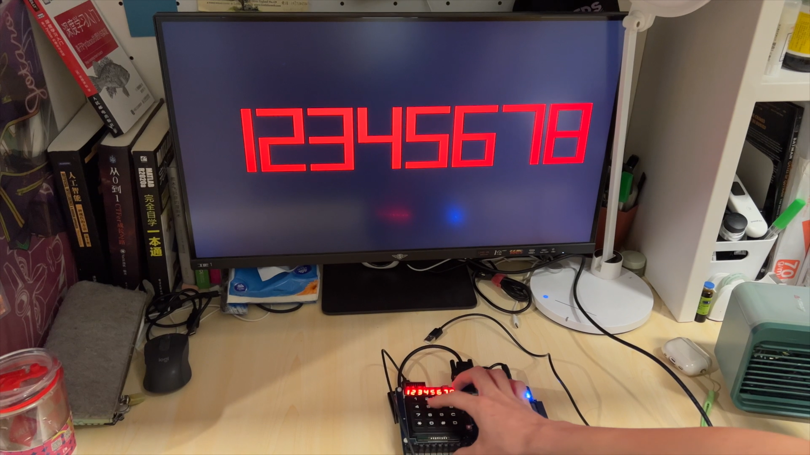

# **CS202 Project CPU Implementation** 


**秦尧 12112016**

**谢尚儒 12112017**

**陶毅诚 12112003**


# Developer's infomation

| Name   | Task                                                         | Contribution |
| ------ | ------------------------------------------------------------ | ------------ |
| 秦尧   | VGA, Decoder, MemOrIO, IFetch, LED, Report                   | 33.3%        |
| 陶毅诚 | CPU-top, ALU, D-memory, Switch, Keyboard, Report ,Bonus video | 33.3%        |
| 谢尚儒 | All assemble scripts, UART, Controller, Report               | 33.3%        |


# CPU architecture design

## CPU characteristics

### ISA

We implemented the **Minisys Instruction Set Architecture**.

#### 1.R Type Instructions

**（1）R Type Instruction Format**

| 000000 (op) | Rs    | Rt    | Rd    | shamt | funct |
| ------------ | ----- | ----- | ----- | ----- | ----- |
| 6bits        | 5bits | 5bits | 5bits | 5bits | 6bits |

**（2）Specific R Type Instructions**

【1】with 3 registers

| 指令 | [31 : 26] | [25 : 21] | [20 : 16] | [15 : 11] | [10 : 6] | [5 : 0]    |
| ---- | --------- | --------- | --------- | --------- | -------- | ---------- |
| nor  | 000000    | rs        | rt        | rd        | 00000    | 100111(27) |
| add  | 000000    | rs        | rt        | rd        | 00000    | 100000(32) |
| addu | 000000    | rs        | rt        | rd        | 00000    | 100001(33) |
| sub  | 000000    | rs        | rt        | rd        | 00000    | 100010(34) |
| subu | 000000    | rs        | rt        | rd        | 00000    | 100011(35) |
| and  | 000000    | rs        | rt        | rd        | 00000    | 100100(36) |
| or   | 000000    | rs        | rt        | rd        | 00000    | 100101(37) |
| xor  | 000000    | rs        | rt        | rd        | 00000    | 100110(38) |
| slt  | 000000    | rs        | rt        | rd        | 00000    | 101010(42) |
| sltu | 000000    | rs        | rt        | rd        | 00000    | 101011(43) |
| sllv | 000000    | rs        | rt        | rd        | 00000    | 000100(4)  |
| srlv | 000000    | rs        | rt        | rd        | 00000    | 000110(6)  |
| srav | 000000    | rs        | rt        | rd        | 00000    | 000111(7)  |

【2】with 2 registers

| 指令 | [31 : 26] | [25 : 21] | [20 : 16] | [15 : 11] | [10 : 6] | [5 : 0]    |
| ---- | --------- | --------- | --------- | --------- | -------- | ---------- |
| sll  | 000000    | 00000     | rt        | rd        | sa       | 100000(32) |
| srl  | 000000    | 00000     | rt        | rd        | sa       | 000010(2)  |
| sra  | 000000    | 00000     | rt        | rd        | sa       | 000011(3)  |

【3】with one register 

| 指令 | [31 : 26] | [25 : 21] | [20 : 16] | [15 : 11] | [10 : 6] | [5 : 0]   |
| ---- | --------- | --------- | --------- | --------- | -------- | --------- |
| jr   | 000000    | rs        | 00000     | 00000     | 00000    | 001000(8) |

#### 2.I Type Instructions

**（1）I Type Instruction Format**

| OP    | Rs    | Rt    | imm    |
| ----- | ----- | ----- | ------ |
| 6bits | 5bits | 5bits | 16bits |

**（2）Specific I Type Instructions**

【1】For ALU

| 指令  | [31 : 26] | [25 : 21] | [20 : 16] | [15 : 0] |
| ----- | --------- | --------- | --------- | -------- |
| addi  | 001000    | rs        | rt        | imm      |
| addiu | 001001    | rs        | rt        | imm      |
| andi  | 001100    | rs        | rt        | imm      |
| ori   | 001101    | rs        | rt        | imm      |
| xori  | 001110    | rs        | rt        | imm      |
| slti  | 001010    | rs        | rt        | imm      |
| sltiu | 001011    | rs        | rt        | imm      |

【2】For memory 

| 指令 | [31 : 26] | [25 : 21] | [20 : 16] | [15 : 0] |
| ---- | --------- | --------- | --------- | -------- |
| lw   | 100011    | rs        | rt        | imm      |
| sw   | 101011    | rs        | rt        | imm      |

【3】LUI

| 指令 | [31 : 26] | [25 : 21] | [20 : 16] | [15 : 0] |
| ---- | --------- | --------- | --------- | -------- |
| lui  | 001111    | 00000     | rt        | imm      |

【4】For branch

| 指令 | [31 : 26] | [25 : 21] | [20 : 16] | [15 : 0] |
| ---- | --------- | --------- | --------- | -------- |
| beq  | 000100    | rs        | rt        | imm      |
| bne  | 000101    | rs        | rt        | imm      |

#### 3. J Type Instructions

**（1）J Type Instruction Format**

| OP    | Imme   |
| ----- | ------ |
| 6bits | 26bits |

**（2）Specific J Type Instructions**

| 指令 | [31 : 26] | [25 : 0] |
| ---- | --------- | -------- |
| j    | 000010    | address  |
| jal  | 001100    | address  |

### Registers

We have 32 registers. Each register has 32 bits.

### Addressing Mode design

We chose **Harvard architecture**.

Addressing unit: word  
Size of instruction space: 64KB  
Data space: 64KB

### Support for external IO

We choose **MMIO**:  
**Addresses of the peripheral:**  
Switch: from 0xFFFF_FC70 to 0xFFFF_FC72  
LED: from 0xFFFF_FC60 to 0xFFFF_FC62  
KeyBoard: 0xFFFF_FC80  
Display (seven segment digital display tube and VGA): 0xFFFF_FC90  
Using **polling** method to access IO.

### CPU Technical Detail

Clock frequency: 20Mhz  
CPI: 1  
Single cycle CPU, no pipeline

## CPU interface

All codes below is in `cpu_top.xdc`.

### CPU Clock

The CPU clock.

```verilog
set_property PACKAGE_PIN Y18 [get_ports {fpga_clk}]
```

### Reset

The reset button.

```verilog
set_property PACKAGE_PIN P1 [get_ports {reset_h}]
```

### UART

```verilog
set_property -dict {IOSTANDARD LVCMOS33 PACKAGE_PIN Y19} [get_ports rx]
set_property -dict {IOSTANDARD LVCMOS33 PACKAGE_PIN V18} [get_ports tx]
```

### Switch

```verilog
set_property PACKAGE_PIN AA8 [get_ports {switch[18]}]
set_property PACKAGE_PIN V8 [get_ports {switch[17]}]
set_property PACKAGE_PIN V9 [get_ports {switch[16]}]
set_property PACKAGE_PIN Y9 [get_ports {switch[23]}]
set_property PACKAGE_PIN W9 [get_ports {switch[22]}]
set_property PACKAGE_PIN Y7 [get_ports {switch[21]}]
set_property PACKAGE_PIN Y8 [get_ports {switch[20]}]
set_property PACKAGE_PIN AB8 [get_ports {switch[19]}]
set_property PACKAGE_PIN AB6 [get_ports {switch[15]}]
set_property PACKAGE_PIN AB7 [get_ports {switch[14]}]
set_property PACKAGE_PIN V7 [get_ports {switch[13]}]
set_property PACKAGE_PIN AA6 [get_ports {switch[12]}]
set_property PACKAGE_PIN Y6 [get_ports {switch[11]}]
set_property PACKAGE_PIN T6 [get_ports {switch[10]}]
set_property PACKAGE_PIN R6 [get_ports {switch[9]}]
set_property PACKAGE_PIN V5 [get_ports {switch[8]}]
set_property PACKAGE_PIN U6 [get_ports {switch[7]}]
set_property PACKAGE_PIN W5 [get_ports {switch[6]}]
set_property PACKAGE_PIN W6 [get_ports {switch[5]}]
set_property PACKAGE_PIN U5 [get_ports {switch[4]}]
set_property PACKAGE_PIN T5 [get_ports {switch[3]}]
set_property PACKAGE_PIN T4 [get_ports {switch[2]}]
set_property PACKAGE_PIN R4 [get_ports {switch[1]}]
set_property PACKAGE_PIN W4 [get_ports {switch[0]}]
```

### LED

```verilog
set_property PACKAGE_PIN K17 [get_ports {led_out[23]}]
set_property PACKAGE_PIN L13 [get_ports {led_out[22]}]
set_property PACKAGE_PIN M13 [get_ports {led_out[21]}]
set_property PACKAGE_PIN K14 [get_ports {led_out[20]}]
set_property PACKAGE_PIN K13 [get_ports {led_out[19]}]
set_property PACKAGE_PIN M20 [get_ports {led_out[18]}]
set_property PACKAGE_PIN N20 [get_ports {led_out[17]}]
set_property PACKAGE_PIN N19 [get_ports {led_out[16]}]
set_property PACKAGE_PIN M17 [get_ports {led_out[15]}]
set_property PACKAGE_PIN M16 [get_ports {led_out[14]}]
set_property PACKAGE_PIN M15 [get_ports {led_out[13]}]
set_property PACKAGE_PIN K16 [get_ports {led_out[12]}]
set_property PACKAGE_PIN L16 [get_ports {led_out[11]}]
set_property PACKAGE_PIN L15 [get_ports {led_out[10]}]
set_property PACKAGE_PIN L14 [get_ports {led_out[9]}]
set_property PACKAGE_PIN J17 [get_ports {led_out[8]}]
set_property PACKAGE_PIN F21 [get_ports {led_out[7]}]
set_property PACKAGE_PIN G22 [get_ports {led_out[6]}]
set_property PACKAGE_PIN G21 [get_ports {led_out[5]}]
set_property PACKAGE_PIN D21 [get_ports {led_out[4]}]
set_property PACKAGE_PIN E21 [get_ports {led_out[3]}]
set_property PACKAGE_PIN D22 [get_ports {led_out[2]}]
set_property PACKAGE_PIN E22 [get_ports {led_out[1]}]
set_property PACKAGE_PIN A21 [get_ports {led_out[0]}]
```

### VGA

```verilog
set_property PACKAGE_PIN M21 [get_ports {hsync}]
set_property PACKAGE_PIN L21 [get_ports {vsync}]

set_property PACKAGE_PIN H20 [get_ports {vga_rgb[0]}]
set_property PACKAGE_PIN G20 [get_ports {vga_rgb[1]}]
set_property PACKAGE_PIN K21 [get_ports {vga_rgb[2]}]
set_property PACKAGE_PIN K22 [get_ports {vga_rgb[3]}]
set_property PACKAGE_PIN H17 [get_ports {vga_rgb[4]}]
set_property PACKAGE_PIN H18 [get_ports {vga_rgb[5]}]
set_property PACKAGE_PIN J22 [get_ports {vga_rgb[6]}]
set_property PACKAGE_PIN H22 [get_ports {vga_rgb[7]}]
set_property PACKAGE_PIN G17 [get_ports {vga_rgb[8]}]
set_property PACKAGE_PIN G18 [get_ports {vga_rgb[9]}]
set_property PACKAGE_PIN J15 [get_ports {vga_rgb[10]}]
set_property PACKAGE_PIN H15 [get_ports {vga_rgb[11]}]
```

### Seven-segment Display Tube

```verilog
set_property PACKAGE_PIN C19 [get_ports {seg_en[0]}]
set_property PACKAGE_PIN E19 [get_ports {seg_en[1]}]
set_property PACKAGE_PIN D19 [get_ports {seg_en[2]}]
set_property PACKAGE_PIN F18 [get_ports {seg_en[3]}]
set_property PACKAGE_PIN E18 [get_ports {seg_en[4]}]
set_property PACKAGE_PIN B20 [get_ports {seg_en[5]}]
set_property PACKAGE_PIN A20 [get_ports {seg_en[6]}]
set_property PACKAGE_PIN A18 [get_ports {seg_en[7]}]

set_property PACKAGE_PIN E13 [get_ports {seg_out[0]}]
set_property PACKAGE_PIN C15 [get_ports {seg_out[1]}]
set_property PACKAGE_PIN C14 [get_ports {seg_out[2]}]
set_property PACKAGE_PIN E17 [get_ports {seg_out[3]}]
set_property PACKAGE_PIN F16 [get_ports {seg_out[4]}]
set_property PACKAGE_PIN F14 [get_ports {seg_out[5]}]
set_property PACKAGE_PIN F13 [get_ports {seg_out[6]}]
set_property PACKAGE_PIN F15 [get_ports {seg_out[7]}]
```

### Keyboard

```verilog
set_property IOSTANDARD LVCMOS33 [get_ports {col[3]}]
set_property IOSTANDARD LVCMOS33 [get_ports {col[2]}]
set_property IOSTANDARD LVCMOS33 [get_ports {col[1]}]
set_property IOSTANDARD LVCMOS33 [get_ports {col[0]}]
set_property IOSTANDARD LVCMOS33 [get_ports {row[3]}]
set_property IOSTANDARD LVCMOS33 [get_ports {row[2]}]
set_property IOSTANDARD LVCMOS33 [get_ports {row[1]}]
set_property IOSTANDARD LVCMOS33 [get_ports {row[0]}]
set_property PACKAGE_PIN M2 [get_ports {col[3]}]
set_property PACKAGE_PIN K6 [get_ports {col[2]}]
set_property PACKAGE_PIN J6 [get_ports {col[1]}]
set_property PACKAGE_PIN L5 [get_ports {col[0]}]

set_property PACKAGE_PIN K4 [get_ports {row[3]}]
set_property PACKAGE_PIN J4 [get_ports {row[2]}]
set_property PACKAGE_PIN L3 [get_ports {row[1]}]
set_property PACKAGE_PIN K3 [get_ports {row[0]}]
```


## CPU internal structure

### Connection Schematic of submodules inside the CPU


### Design Specification of submodules

#### CPU_top(cpu_top.v)

```verilog
module cpu_top (
input fpga_clk,  //clock
input[23:0] switch,  //24 switches
input reset_h,  //reset

//keyboard
input[3:0] row,
output[3:0] col,

//24 LEDs
output[23:0] led_out, 

//seven segment digital display tube
output[7:0] seg_out, 
output[7:0] seg_en,

//VGA
output hsync,
output vsync,
output [11:0] vga_rgb,

//Uart input and output
input start_pg,
input rx,
output tx
);
```


#### ALU(alu.v)

```verilog
module Executs32 ( 
// from Decoder
input[31:0] Read_data_1, //the source of Ainput
input[31:0] Read_data_2, //one of the sources of Binput
input[31:0] Sign_extend, //one of the sources of Binput
// from IFetch
input[5:0] Exe_opcode, //instruction[31:26]
input[5:0] Function_opcode, //instructions[5:0]
input[4:0] Shamt, //instruction[10:6], the amount of shift bits
input[31:0] PC_Plus_4, //pc
// from Controller
input[1:0] ALUOp, //{ (R_format || I_format) , (Branch || nBranch) }
input ALUSrc, // 1 means the 2nd operand is an immediate (except beq,bne）
input I_format, // 1 means I-Type instruction except beq, bne, LW, SW
input Sftmd, // 1 means this is a shift instruction

output reg [31:0]  ALU_Result, // the ALU calculation result
output Zero, // 1 means the ALU_result is zero, 0 otherwise
output[31:0] Addr_Result // the calculated instruction address
);
```


#### Data Memory(dmemory32.v)

```verilog
module dmemory32(clock,memWrite,address,writeData,readData,upg_rst_i,upg_clk_i,upg_wen_i,upg_adr_i,upg_dat_i,upg_done_i );
input clock, memWrite;  //memWrite (from controller，when it is 1'b1, data-memory will be written)
input [31:0] address;   //address (the unit is byte)
input [31:0] writeData; //writeData (data write to data-memory)
output[31:0] readData;  //readData (data read from data-memory)

// UART Programmer Pinouts
input upg_rst_i; // UPG reset (Active High)
input upg_clk_i; // UPG ram_clk_i (10MHz)
input upg_wen_i; // UPG write enable
input [13:0] upg_adr_i; // UPG write address
input [31:0] upg_dat_i; // UPG write data
input upg_done_i; // 1 if programming is finished
```


#### Instruction Fetch(ifetch.v)

```verilog
module IFetc32(Instruction, branch_base_addr, link_addr, clk, rst_n, Addr_result, Read_data_1, Branch, nBranch, Jmp, Jal, Jr, Zero
,upg_rst_i,upg_clk_i,upg_wen_i,upg_adr_i,upg_dat_i,upg_done_i);
    // output reg [31:0] Instruction_test;
    output[31:0] Instruction; // the instruction fetched from this module to Decoder and Controller
    output[31:0] branch_base_addr; // (pc+4) to ALU which is used by branch type instruction
    output reg [31:0] link_addr; // (pc+4) to Decoder which is used by jal instruction
    //from CPU TOP
    input clk, rst_n; // Clock and rst_n
    // from ALU
    input[31:0] Addr_result; // the calculated address from ALU
    input Zero; // while Zero is 1, it means the ALUresult is zero
    // from Decoder
    input[31:0] Read_data_1; // the address of instruction used by jr instruction
    // from Controller
    input Branch; // while Branch is 1,it means current instruction is beq
    input nBranch; // while nBranch is 1,it means current instruction is bnq
    input Jmp; // while Jmp 1, it means current instruction is jump
    input Jal; // while Jal is 1, it means current instruction is jal
    input Jr; // while Jr is 1, it means current instruction is j

    input upg_rst_i; // UPG reset (Active High)
    input upg_clk_i; // UPG clock (10MHz)
    input upg_wen_i; // UPG write enable
    input[13:0] upg_adr_i; // UPG write address
    input[31:0] upg_dat_i; // UPG write data
    input upg_done_i ;// 1 if program finished
```


#### MemOrIO(MemOrIO.v)

```verilog
module MemOrIO(mRead, mWrite, ioRead, ioWrite, addr_in, addr_out, m_rdata, io_rdata, r_wdata, r_rdata, write_data, LEDCtrl, SwitchCtrl,KeyBoardCtrl, displayCtrl);

//control signals from controller
input mRead, mWrite, ioRead, ioWrite;

//address of memory or IO
input [31:0] addr_in;
output [31:0] addr_out;

input [31:0] m_rdata; //data read from memory
input [31:0] io_rdata; //data read from IO
output reg [31:0] r_wdata; //data write to register

input [31:0] r_rdata; //data read from register
output reg [31:0] write_data; //data write to memory or IO

//control signals of IO
output LEDCtrl, SwitchCtrl, KeyBoardCtrl, displayCtrl;
```


#### Decoder(decoder.v)

```verilog
module decoder32(
    input clk,
    input rst_n,
    input jal, //whether the current instruction is jump and link

    input extend_mode, //1 indicate zero extension and 0 indicate sign extension

    //read addresses
    input [4:0] read_reg1,
    input [4:0] read_reg2,
    //write address
    input [4:0] write_reg,

    input [15:0] to_extend_data, //data to be extended
    input [31:0] write_data, //data write to register
    input reg_write, //write enable

    //data read from registers
    output [31:0] read_data1,
    output [31:0] read_data2,

    //data after extension
    output reg [31:0] extended_data
);
```


#### Controller(contol32.v)

```verilog
module control32(Opcode,func,Alu_resultHigh,jr,jmp,jal,branch,nbranch,regDST,memToReg,regWrite,IORead,IOWrite,memWrite,ALUSrc,I_format,Sftmd,ALUOp,extend_mode);
input [5:0] Opcode;
input [5:0] func;
input [21:0] Alu_resultHigh;
output jr ; // 1 indicates the instruction is "jr", otherwise it's not "jr" output Jmp; // 1 indicate the instruction is "j", otherwise it's not
output jmp;
output jal; // 1 indicate the instruction is "jal", otherwise it's not
output branch; // 1 indicate the instruction is "beq" , otherwise it's not
output nbranch; // 1 indicate the instruction is "bne", otherwise it's not
output regDST; // 1 indicate destination register is "rd"(R),otherwise it's "rt"(I)
output memToReg; // 1 indicate read data from memory and write it into register
output regWrite; // 1 indicate write register(R,I(lw)), otherwise it's not
output IORead; // 1 indicate read data from IO, otherwise it's not
output IOWrite; // 1 indicate write data into IO, otherwise it's not
output memWrite; // 1 indicate write data memory, otherwise it's not
output ALUSrc; // 1 indicate the 2nd data is immidiate (except "beq","bne")
output I_format;
output Sftmd; // 1 indicate the instruction is shift
output [1:0] ALUOp;
output extend_mode; //1 indicate zero extension and 0 indicate sign extension
```


# Test Demonstration

## On Board Test
Test type: integration

### **Basic Test Scenario 1**

Note: 3+8 switch on the development board are used for input, of which 3 switches (x2,.. x0) are used for number input of test cases, 8 switches (sw7,.. sw0) are used for input of test data, and LED lights or seven-segments display tubes are used for output

| **ID** | **Testcase Description**                                     |
| ------ | ------------------------------------------------------------ |
| 3‘b000 | Enter the test number **a**, display **a** on the LED light. At the same time, use one LED light to determine **whether a is a power of two** (e.g. 8'h01 and 8'h10 are powers of two, the LED light is on. 8'ha0 and 8'h0a are not powers of two, the LED light is not on) |
| 3‘b001 | Input the test number **a**, display **a** on the output device. At the same time, use one LED light to display **whether a is an odd number**(e.g, 8'h01 and 8'hab are odd numbers, the LED light will be on. 8'ha0 and 8'hbc are not odd numbers, the LED light is not on) |
| 3‘b010 | Execute testcase 3'b111 first, then calculate the bitwise **OR** operation of **a** and **b**, and display the results on the output device |
| 3‘b011 | Execute testcase 3'b111 first, then calculate the bitwise **NOR** operation of **a** and **b**, and display the results on the output device |
| 3‘b100 | Execute test case 3'b111 first, then calculate the bitwise **XOR** operation of **a** and **b**, and display the results on the output device |
| 3‘b101 | First execute test case 3'b111, then execute the **SLT** instruction, **compare a and b as signed numbers**, and use the output device to demonstrate whether the relationship between a and b is valid.(Relationship established, light on, relationship not established, light off) |
| 3‘b110 | First execute test case 3'b111, then execute the **SLTU** instruction, **compare a and b as unsigned numbers**, and use the output device to demonstrate whether the relationship between a and b is valid(Relationship established, light on, relationship not established, light off) |
| 3‘b111 | Input test number a, input test number b, and display the values of a and b on the output device |

### Test Results

| ID     | Input/Operation | Output/Behavior | Result |
| ------ | --------------- | --------------- | ------ |
| 3'b000 | 8'b0000_0100    | 1'b1            | Pass   |
| 3'b001 | 8'b0000_1001    | 1'b1            | Pass   |
| 3'b010 | N/A             | 8'b1111_1100    | Pass   |
| 3'b011 | N/A             | 8'b0000_0011    | Pass   |
| 3'b100 | N/A             | 8'b1100_1100    | Pass   |
| 3'b101 | N/A             | 1'b0            | Pass   |
| 3'b110 | N/A             | 1'b1            | Pass   |
| 3'b111 | a = 8'b0011_1100, b = 8'b1111_0000|N/A| Pass   |

### **Basic Test Scenario 2-1**

3+8 switch on the development board are used for input, of which 3 switch (x3-x0) are used for the number input of test cases, and 8 switch (sw7,.. Sw0) are used for the input of test data (sw7 corresponds to the highest bit bit of 8bit bit7, sw0 corresponds to the lowest bit bit bit of 8bit bit0);

| **ID** | **Testcase Description**                                     |
| ------ | ------------------------------------------------------------ |
| 3‘b000 | Enter the numerical value of **a** (**a is considered a signed number**), **calculate the cumulative sum of 1 to a,** and display the cumulative sum on the output device **(if a is a negative number, give a blinking prompt**) |
| 3‘b001 | Enter the numerical value of **a (a is considered an unsigned number), recursively calculate the sum of 1 to a**, record the number of times the stack was pushed and pushed, and **display the sum of the times the stack was pushed and popped on the output device** |
| 3‘b010 | Enter the numerical value of **a (a is considered an unsigned number)**, **recursively calculate the sum of 1 to a,** record the data of stack entry and exit, and **display the parameters which is pushed to the stack on the output device**. **Each parameter of the stack is displayed for 2-3 seconds** (indicating that the output here does not pay attention to the stack entry and exit information of $ra) |
| 3‘b011 | Enter the numerical value of **a (a is considered an unsigned number)**, **recursively calculate the sum of 1 to a,** record the data of stack entry and exit, and **display the parameters which is popped from the stack on the output device**. **Each parameter of the stack is displayed for 2-3 seconds** (indicating that the output here does not pay attention to the stack entry and exit information of $ra) |
| 3‘b100 | Input test number **a** and test number **b** to implement the **addition of signed numbers** (**a, b, and the sum of additions are all 8 bits, where the highest bit is considered the sign bit. If the sign bit is 1, it represents the 2’s complement of the negative number**), and determine whether overflow occurs. **Output the operation result and overflow judgment** |
| 3‘b101 | Input test number **a** and test number **b** to **subtract signed numbers** (**a, b, and the difference are all 8 bits, where the highest bit is considered as the sign bit. If the sign bit is 1, it represents the 2’s complement of the negative number**), and determine whether overflow occurs. Output the operation result and overflow judgment |
| 3‘b110 | Input test number **a** and test number **b** to implement **the multiplication of signed numbers (a and b are both 8 bits, the product is 16 bits, and the highest bit is considered as the sign bit. If the sign bit is 1, it represents the 2’s complement of the negative number)**, and **output the product** |
| 3‘b111 | Input test number **a** and test number **b** to achieve **division of signed numbers (a, b, quotient and remainder are both 8 bits, where the highest bit is considered the sign bit. If the sign bit is 1, it represents the complement of the negative number**), and **output quotient and remainder (quotient and remainder are displayed alternately, each lasting for 5 seconds)** |

### Test Results

| ID     | Input/Operation | Output/Behavior | Result |
| ------ | --------------- | --------------- | ------ |
| 3'b000 | 8'b0000_0100    | 8'b0000_1010    | Pass   |
| 3'b001 | 8'b0000_0100    | 8'b0001_0000    | Pass   |
| 3'b010 | 8'b0000_0100    | 8'd4, 8'd3, 8'd2, 8'd1 | Pass   |
| 3'b011 | 8'b0000_0100    | 8'd1, 8'd2, 8'd3, 8'd4 | Pass   |
| 3'b100 | a = 8'b0111_1111, b = 8'b0111_1111 | overflow = 1'b1 | Pass   |
| 3'b100 | a = 8'b0000_1001, b = 8'b0000_1111 | overflow = 1'b0, result = 8'b0001_1000 | Pass   |
| 3'b101 | a = 8'b1000_0001, b = 8'b0111_1111 | overflow = 1'b1 | Pass   |
| 3'b101 | a = 8'b1111_1000, b = 8'b0000_0101 | overflow = 1'b0, result = 8'b1111_0011 | Pass   |
| 3'b110 | a = 8'b1111_1000, b = 8'b0000_0101 | 16'b1111_1111_1101_1000 | Pass   |
| 3'b111 | a = 8'b1111_1000, b = 8'b0000_0101 | quotient = 8'b1111_1111, remainder = 8'b1111_1101 | Pass   |

## Final Test Conclusion
The cpu passed all the testcases and functioned correctly

# Bonus

### VGA interfaces
The VGA interfaces have three modules. They are vga_main, vga_ctrl and vga_pic

vga_main:

Inputs and outputs:

```verilog
module vga_main(
    input wire clk_vga, //clock for vga
    input wire rst_n, //reset
    input wire [63:0] display_in, //the data to be displayed in vga

    //vga outputs
    output wire hsync,
    output wire vsync,
    output wire [11:0] vga_rgb
);
```

vga_ctrl:
This module generates the control signals of vga

Inputs and outputs:

```verilog
module vga_ctrl(
    input wire clk,
    input wire rst_n,

    //coordinates of pixel
    output wire [10:0] pix_x,
    output wire [10:0] pix_y,

    //sync signals
    output wire hsync,
    output wire vsync,

    //whether the current coordinates are in the valid display range
    output wire is_valid
);
```

Core code:

```verilog
//parameters obtained from vga timing standard (excerpt)
parameter H_SYNC = 11'd128,
          H_BACK = 11'd88,
          H_LEFT = 11'd0,
          H_VALID = 11'd800,
          H_RIGHT = 11'd0,
          H_FRONT = 11'd40,
          H_TOTAL = 11'd1056;

//scan the pixels of the screen (excerpt)
always @(posedge clk or negedge rst_n) begin
    if (rst_n == 1'b0) begin
        cnt_h <= 11'd0;
    end
    else if (cnt_h == (H_TOTAL - 1'b1)) begin
        cnt_h <= 11'd0;
    end
    else begin
        cnt_h <= cnt_h + 11'd1;
    end
end

//generate control signals (excerpt)
assign is_valid = ((cnt_h >= H_SYNC + H_BACK + H_LEFT) && (cnt_h < H_SYNC + H_BACK + H_LEFT + H_VALID)
                    && (cnt_v >= V_SYNC + V_BACK + V_TOP) && (cnt_v < V_SYNC + V_BACK + V_TOP + V_VALID))
                    ? 1'b1 : 1'b0;

assign pix_x = (is_valid == 1'b1) ? (cnt_h - (H_SYNC + H_BACK + H_LEFT)) : 11'd0;
assign pix_y = (is_valid == 1'b1) ? (cnt_v - (V_SYNC + V_BACK + V_TOP)) : 11'd0;
```


vga_pic:
This module generates the picture to be displayed in vga

Inputs and outputs:

```verilog
module vga_pic(
    input wire clk,
    input wire rst_n,

    //the coordinates of pixel and the data to be displayed
    input wire [10:0] pix_x,
    input wire [10:0] pix_y,
    input wire [63:0] display_in,

    //the rgb value of the pixel
    output reg [11:0] pix_data
);
```

Core code:

```verilog
//generate picture (excerpt)
parameter   RED     = 12'hF00,
            BLACK   = 12'h000;

always@ (posedge clk or negedge rst_n) begin
    if (rst_n == 1'b0) begin
        pix_data <= BLACK;
    end
    else if ((pix_x >= 11'd40) && (pix_x < 11'd120) && (pix_y >= 11'd200) && (pix_y < 11'd216) && (display_in[63] == 1'b1)) begin
        pix_data <= RED;
    end
    else if ((pix_x >= 11'd104) && (pix_x < 11'd120) && (pix_y >= 11'd200) && (pix_y < 11'd280) && (display_in[62] == 1'b1)) begin
        pix_data <= RED;
    end
```


### mini keyboard interfaces
For the mini keyboard, we study the existing code on Github and make some adjustments to fit our design.
The principle of the keyboard is using column signal and row signal to locate a specific key in the keyboard. We offer the keyboard a column selection signal to select a column, then the board will return a row selection signal to show which key is pressed. This is achieved by a finite state machine which scans the keyboard continuously.
We made small adjustments that the clock signal(used to de-twitter) fits our cpu clock signal.
Also we import control signal like IORead and KeyBoardCtrl to control the input of keyboard.
Since we choose to implement MMIO way to connect our external IO, the address of our keyboard is 0x FFFF FC80. Moreover, we change the output of the keyboard so that once a key is released, the output value will be automatically set to 5’b1. This is to avoid data misuse in our asm file.

Inputs and output:

```verilog
module keyboard(
  input            clk, //20Mhz
  input            rst,

  //control signals
  input         IORead,
  input   KeyBoardCtrl,

  //row selection and column selection signals
  input      [3:0] row,      
  output reg [3:0] col,

  //output data, which will be written to register
  output reg [31:0] io_rdata
);
```

### Test description

We design a testcase to verify our design of the VGA and the keyboard interfaces. In the testcase, we use lw instruction to get input data from the keyboard. Then we process the data and store the data in a register. Finally, we use sw instruction to display the data in the VGA.  
The result is as follows, the cpu and the IO modules functioned correctly.



### Uart interface

We implemented the uart interface so we can load different programs onto the cpu for execution without rewriting the FPGA chip. We have described the interface in the basic part of the report.

### Better user experience

- The results of bit operations are displayed with LED, and the results of arithmetic operations are displayed with 7 segments of Nixie tube as well as VGA.
- This part is implemented with our asm files, as we not only load the result into our LED, but also into our display module.

### One more thing : Debug Hub

- This part is a bonus in our opinion, as this provides a practical debug solution after using debug hub in Vivado. Otherwise it will be pretty hard to fix a bug.
- We can open the synthesis design and add debug hub to the signals we want to capture. After regenerating the bitstream and programing our board, we can directly view the signal wave diagram in Vivado.
- We may set trigger to record a specific period signal and analysis its behavior.

# Problems and Summary

1. When writing codes in verilog, we should follow the rules strictly. Otherwise the circuit will behave very differently than expected.
2. The warnings raised by vivado are very important. Many warnings are raised because our codes not follow the rules strictly. We can fix them quickly by looing at the warnings.
3. When we find some strange bugs and do not know how do they come, we should check the ip cores first. Some wrong settings in ip cores may make the circuit behaves quite differently than expected.
4. Every time we finish writing a module, we should test it. If we do not test the modules before we put them together, debug will be very difficult.
5. When we test the cpu, we should start from the simplest case and do not write too many instructions in a asm file. So we can find bugs easily.
